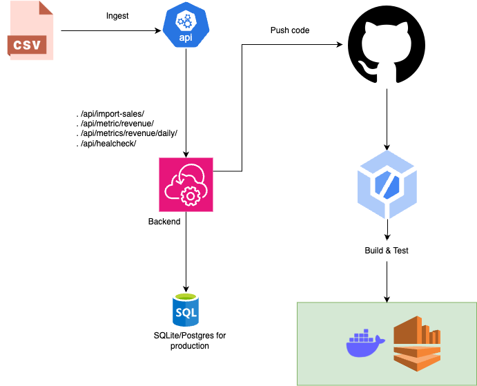

# Part B: Architecture & Design Document

**Candidate:** Huynh  
**Role:** Software Developer
**Stack:** Django + DRF + Docker + GitHub Actions + SQLite

---

## 1. High-Level Architecture Diagram



- The user triggers ingestion from a CSV file.
- Django reads the CSV and stores data in SQLite.
- APIs expose aggregated metrics.
- CI/CD ensures code quality and builds Docker images automatically.

---

## 2. API & Data Model Sketch

### APIs

| Endpoint                     | Method | Description                         |
|------------------------------|--------|-------------------------------------|
| `/api/import-sales/`         | GET    | Ingest sales from `sales.csv`       |
| `/api/metrics/revenue/`      | GET    | Total and average revenue           |
| `/api/metrics/revenue/daily/`| GET    | Daily revenue grouped by date       |
| `/api/health/`               | GET    | Health check (DB connectivity)      |

### Data Model

```python
class Sale(models.Model):
    date = models.DateField()
    order_id = models.CharField(max_length=50)
    product_id = models.CharField(max_length=100)
    amount_sgd = models.FloatField()
```

---

## 3. Infrastructure Choices

| Component         | Choice           | Justification                                   |
|-------------------|------------------|-------------------------------------------------|
| Web Framework     | Django + DRF     | Rapid development, ORM, API handling            |
| DB                | SQLite           | Lightweight for assignment, easy to run         |
| Containerization  | Docker           | Reproducible builds, portable                   |
| WSGI Server       | Gunicorn         | Production-grade                                |
| CI/CD             | GitHub Actions   | Automated test/build                            |
| Logging           | python-json-logger + middleware | Structured logs with `request_id`|

---

## 4. Scaling & Resilience Strategy

- Replace SQLite with PostgreSQL for concurrent writes and volume.
- Add Redis caching for frequent metrics queries.
- Enable pagination and filtering for endpoints.
- Deploy to AWS ECS/Fargate or GCP Cloud Run with Docker image.

---

## 5. CI/CD & Rollback Plan

- GitHub Actions triggers on push to `main`.
- Runs migrations, unit tests, and Docker build.
- CI validates correctness before deploy.
- In production: tag and version Docker images; rollback = redeploy prior tag.

---

## 6. Observability & SRE

- All API logs are structured JSON with timestamp, request_id, endpoint, params.
- `RequestIDMiddleware` injects UUID into each request.
- Health endpoint verifies DB access.
- Logs flow through stdout (Docker-compatible).

---

## 7. Trade-Off Discussion

| Area           | Decision                          | Trade-Off                 |
|----------------|-----------------------------------|---------------------------|
| DB             | SQLite for simplicity             | Not scalable for prod     |
| CSV Source     | Local file                        | No file upload API        |
| API View       | DRF APIView over function views   | Slightly more verbose     |
| Dockerfile     | Multi-stage                       | Small image size          |
| CI             | GitHub Actions only               | No deploy, just build/test|
| Logging        | Custom middleware                 | More setup, more control  |


---

### 1. Component Overview (Based on Visual Flow)

```
[CSV File] → [API] → [Stateless Web Servers] → [Database (PostgreSQL)]
                                ↓
                             [GitHub]
                                ↓
                          [GitHub Actions CI/CD]
                                ↓
                       [Docker Build + Deploy]
                                ↓
        ┌────────────────────────────────────────────────────────┐
        │                 Scalable Infrastructure               │
        └────────────────────────────────────────────────────────┘
```

---

### 2. Data Flow Breakdown

**1. CSV Ingest:**

* User submits a CSV file (e.g., sales data).
* File is ingested via `/api/import-sales/` endpoint exposed by the API layer.

**2. API Layer:**

* Handles endpoints:

  * `/api/import-sales/`
  * `/api/metrics/revenue/`
  * `/api/metrics/revenue/daily/`
  * `/api/healthcheck/`
* API runs as a Django REST Framework application deployed on stateless servers.

**3. Backend Stateless Web Servers:**

* Horizontal scaling supported via load balancer.
* Deployed using Docker containers.
* Stateless design allows multiple instances.

**4. Database Layer:**

* PostgreSQL (production-grade) with support for:

  * Sharding (horizontal scaling by user/region)
  * Replication (read scalability)
  * Failover (availability across data centers)

**5. CI/CD Flow:**

* Developers push code to GitHub.
* GitHub Actions performs:

  * Linting, testing, migration checks
  * Docker image build
* Artifact deployed to EC2 (or ECS/Kubernetes in the future)

**6. Message Queue (Optional for scaling):**

* For large file ingestion, rows are enqueued to a queue (e.g., RabbitMQ/SQS).
* Worker services asynchronously process and save rows.

**7. CDN & Static Content (Optional):**

* Frontend assets or dashboards served through CDN.
* Enhances global performance and reduces backend load.

---

### 3. Resilience & Scalability Diagram Highlights

* **Load Balancer** distributes API traffic.
* **Multiple Web Servers** ensure horizontal scaling.
* **Master DB with Shards** ensures write scalability.
* **Read Replicas** handle read-heavy analytics endpoints.
* **Failover to Data Center 2** ensures high availability.
* **Message Queue** decouples ingestion from compute.

---

### 4. Summary

This infrastructure transitions the Zinc assignment from a single-user local Django project to a robust, scalable system supporting high traffic, asynchronous data processing, and resilient deployment through CI/CD and cloud infrastructure.
